<h1 align="center">KeiChat 基于 .NET 9 的现代化 WPF 桌面即时通讯系统</h1>

<p align="center">
  <strong> 多进程架构 · MMF 零拷贝通信 · 严格 MVVM 设计</strong>
</p>
<p align="center">
  <a href="https://dotnet.microsoft.com/"></a>
  <a href="https://github.com/dotnet/wpf"></a>
  <a href="https://www.microsoft.com/windows"></a>
  <a href="LICENSE"></a>
  <a href="https://github.com/macroecho/keichat.wpf/stargazers"></a>
</p>
<p align="center">
  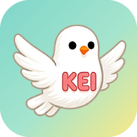
</p>


---


## 📖 项目简介

&emsp;&emsp;**KeiChat** 是一款始于 **2018 年**的桌面即时通讯系统，早期基于 .NET Framework 4.5 + WPF 构建，作为公司内部核心通讯工具持续服务于日常协作。历经多年业务考验与架构演进，项目先后跨越 .NET Framework 4.5 → .NET Core → .NET 5/6/8，最终于 .NET 9 时代完成全面现代化升级，如今正式开源，回馈社区。

&emsp;&emsp;八年来，**KeiChat** 伴随着公司内部业务的持续增长不断迭代，从最初满足基础通讯需求的内部工具，逐步演进为如今架构成熟、性能卓越的桌面 IM 解决方案。每一个架构决策，都来自真实高并发场景下的实战检验。

&emsp;&emsp;在架构设计上，**KeiChat** 深度参考主流 IM 的最佳实践，采用**多进程架构**，彻底实现消息通信与 UI 渲染的解耦；通过 <b>MemoryMappedFile（内存映射文件）</b> 技术实现进程间**零拷贝数据传输**，在确保界面极致流畅、响应灵敏的同时，为高并发消息处理、大文件传输及实时通知提供了坚实的底层支撑。

&emsp;&emsp;在实时通信上，**KeiChat** 采用了**原生 Socket + 自定义二进制协议 + SSL/TLS 加密**构建实时通信层，支持文本、表情、图片、视频、文件、名片、转发、撤回、收藏等完整 IM 功能矩阵，覆盖单聊、群聊、联系人管理、好友圈等核心场景，是构建企业级内部通讯系统的理想解决方案。

> 本项目既可作为 **WPF MVVM 架构最佳实践**的学习案例，也可作为**高性能桌面 IM 项目**的二次开发基础。

#### 最新版本 · 现代化界面（.NET 9 ）

基于 .NET 9 全面重构，多主题模式、多进程架构、零拷贝通信、极致流畅体验。

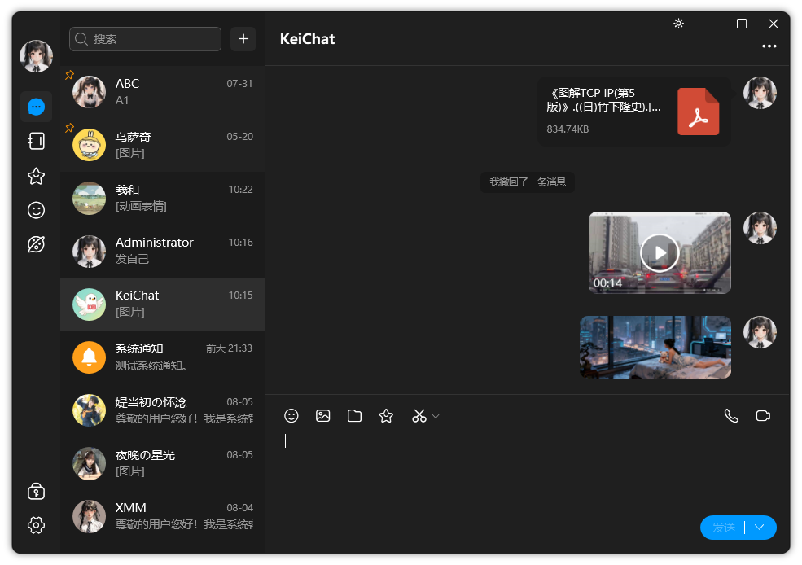


#### 2018 年 · 早期版本（.NET Framework 4.5）

经典 WPF 风格界面，满足团队基础即时通讯需求。

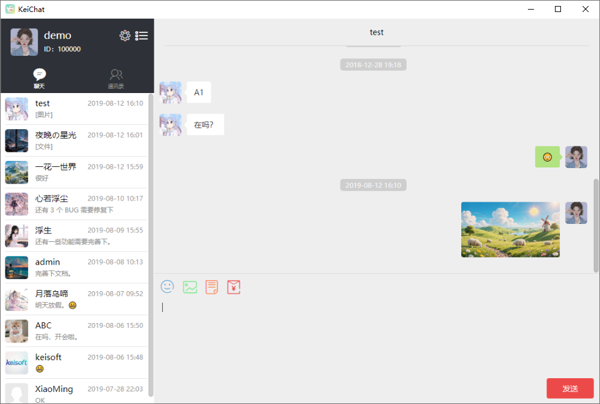

---


## ✨ 核心架构亮点

### 1. 🎖️ 严格 MVVM 与 UI 解耦
项目采用 **C# WPF MVVM (Model-View-ViewModel)** 模式，彻底分离 UI 与业务逻辑：
- **数据驱动 UI**：通过 `INotifyPropertyChanged` 和 `ICommand` 实现界面动态更新，无需手动操作控件。
- **高可测试性**：业务逻辑集中于 ViewModel，支持脱离 UI 进行单元测试。
- **代码复用**：核心业务逻辑可无缝迁移至其他 .NET 平台（如 MAUI, Avalonia）。

### 2. ⚡ 多进程架构：UI 与通信进程隔离
为了解决 UI 卡顿与实时通信阻塞问题，项目采用了多进程架构：

| 进程                 | 职责                                                |
| -------------------- | --------------------------------------------------- |
| **UI 渲染进程**      | 负责界面展示、动画、输入交互、会话管理              |
| **通信进程**         | 负责 Socket 连接、消息收发、好友/群组同步、推送通知 |
| **文件进程**         | 图片处理、视频处理、文件传输                        |
| **图片视频媒体进程** | 浏览图片和播放视频                                  |

**优势**：

- UI 进程始终轻量，消息洪峰时依然保持 **60 FPS 的丝滑体验**
- 通信、文件、图片视频媒体进程异常或重启，不影响 UI 进程稳定性

#### **进程架构的协作**：

- **Socket 接收线程** → 接收服务器二进制数据包，校验与反序列化
- **消息分发线程** → 将消息按会话分类，写入对应 MMF 区域
- **UI 进程** → 监听 MMF 变更事件，读取消息并更新 ViewModel
- **发送流程** → UI → MMF → 通信进程 → 序列化 → SSL Socket → 服务器

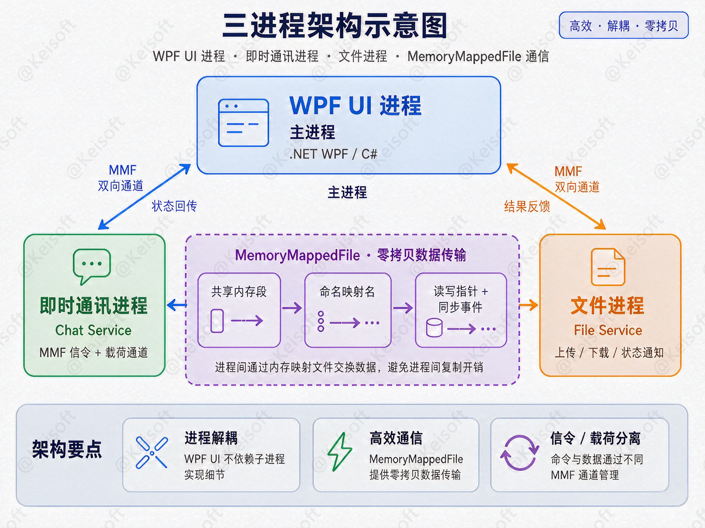

### 3. 🛰️ 实时通信技术

**KeiChat** 的实时消息系统完全基于**原生 Socket** 构建，而非 HTTP 长轮询或高层封装协议：

#### 自定义二进制数据包协议

为降低带宽占用并提升解析效率，设计了轻量级二进制协议：

| 字段             | 说明                                         |
| --------------- | -------------------------------------------- |
| `Version`       | 协议版本号                                     |
| `SerializeType` | 序列化类型                                     |
| `PacketType`    | 数据包类型（单聊/群聊/心跳）                  |
| `SequenceId`    | 数据包序列号，用于去重与排序                     |
| `BodyLength`    | 包体长度                                       |
| `Body`          | 序列化后的消息数据（MemoryPack / Protobuf） |
| `Checksum`      | CRC32 校验，防止数据损坏                        |

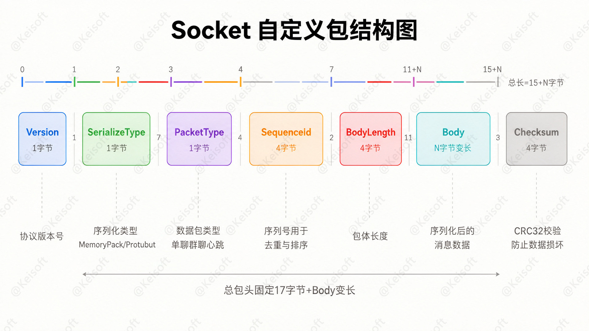

#### SSL/TLS 加密传输

- 使用 `SslStream` 封装原始 Socket，实现端到端加密（TLS 1.2+）
- 客户端校验服务器证书，防止中间人攻击
- 所有消息、信令数据均通过加密通道传输

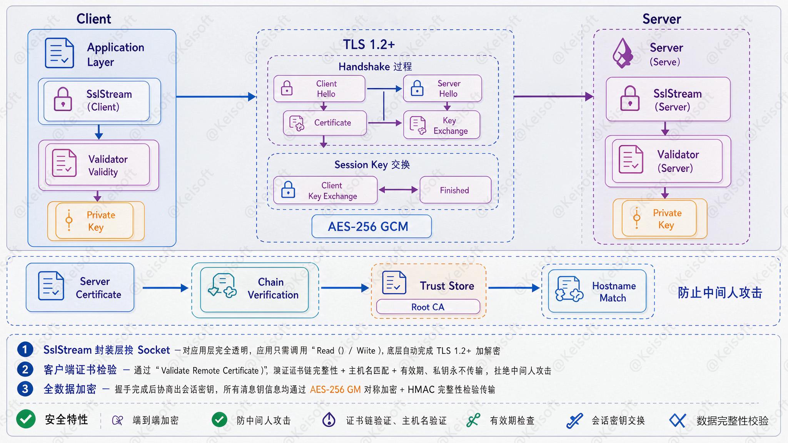

### 4.🧾  数据同步设计

**KeiChat** 需要从业务服务器获取**用户列表、好友列表、群组列表、群组成员**等大量数据。若每次都全量拉取，存在以下问题：

- **流量浪费**：客户端本地已缓存绝大部分数据，重复下载成本高；
- **响应慢**：数据量大时首屏等待时间长；
- **服务器压力大**：大量重复查询挤占资源。

基于上述问题，我们采用**增量同步 (Incremental Sync)** 策略，核心目标是：首次启动时全量拉取并缓存至本地 SQLite；此后每次启动或下拉刷新时，仅同步自上次成功同步以来**新增或修改**的数据，最大限度减少流量、提升响应速度、降低服务端压力。

客户端每次发起同步请求时，携带**上一次同步成功的时间戳 (Timestamp)**；服务器据此仅返回该时间戳之后发生变更的数据。客户端将增量结果落地本地数据库（覆盖或插入），从而与远端保持一致。整个机制可以概括为**三个核心要素**：

- **同步锚点**：客户端记录的"我已同步到哪个时间点"，即上一次成功同步的 `Timestamp`。
- **变更数据**：服务器只返回 `update_time > anchor` 的数据（新增 + 修改）。
- **本地持久化**：增量数据落地 SQLite，覆盖/插入，缓存长期有效。

> 📌 **一句话总结**：客户端用 `anchor` 记住"同步到哪里"，服务端只返回此后的变更，客户端在事务中幂等地落库并更新锚点——从而形成高效、可靠、断点续传的增量同步闭环。

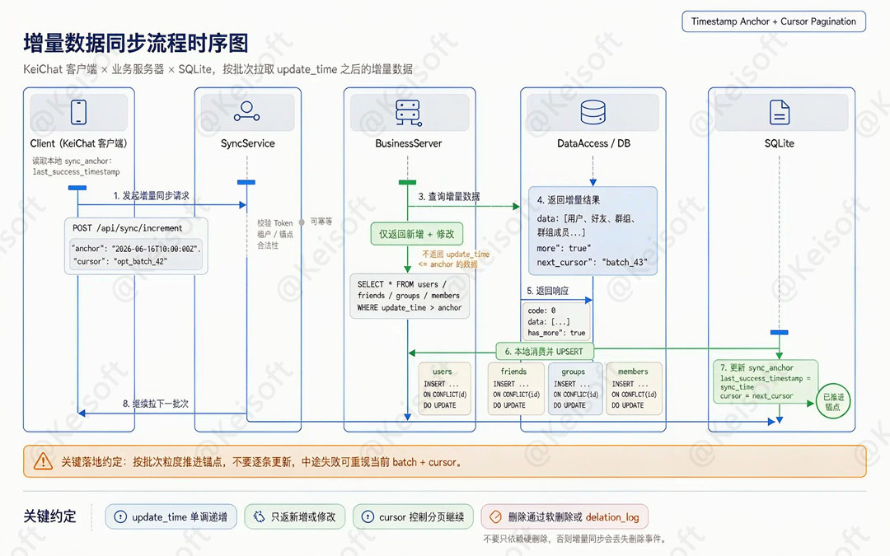

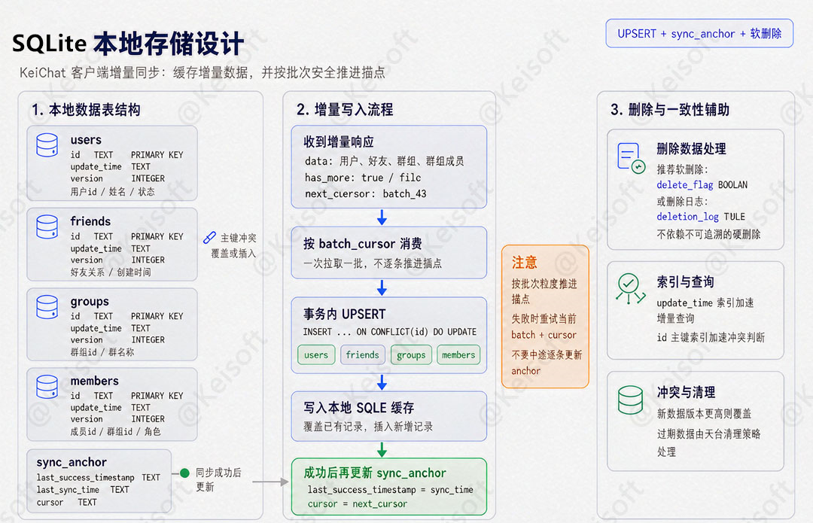

### 5.🔒  HTTPS  安全性

**KeiChat** 为防范传输层中间人攻击（Man-in-the-Middle, MITM），客户端在 HTTPS 通信中实施了严格的<b>证书绑定（SSL/TLS Pinning）</b>策略。具体实现如下：

1. **预置信任锚**：将服务端默认的 X.509 证书哈希硬编码至客户端资源中。
2. **握手期强校验**：TLS 握手时，除系统级 CA 信任链验证外，额外执行证书指纹比对，仅接受与锁定信息完全匹配的服务器证书。
3. **防御效果**：由于主流抓包代理工具依赖动态签发伪造证书，其证书指纹无法匹配客户端内置的信任锚，握手将被主动终止 (`SSLHandshakeException`)。从而有效杜绝了通过诱导用户安装代理 CA 证书进行的流量解密、请求篡改与敏感信息泄露风险。

---


## 🎯 功能一览

### 💬 聊天功能

| 功能名称 | 功能介绍 |
|---|---|
| 📝 **文本消息** | 单次最大支持 800 个字符；支持默认表情、自动识别链接和号码 |
| 😊 **表情消息** | 可发送收藏的动画表情；收到的表情可添加到自己的表情列表 |
| 🖼️ **图片消息** | 单次最多发送 9 张；支持压缩、断点续传、原图查看、保存 |
| 🎬 **视频消息** | 单次最多发送 1 个；支持断点续传、上传进度与状态显示 |
| 📁 **文件消息** | 单次最多发送 1 个；支持断点续传、上传进度与状态显示 |
| 📇 **名片消息** | 可发送联系人个人信息名片；收到的名片可查看详情或加为好友 |
| ↪️ **转发消息** | 支持逐条转发和合并转发，可转发给多个联系人 |
| ↩️ **撤回消息** | 发送 2 分钟内可撤回；文本消息撤回 5 分钟内可重新编辑再发 |
| ⭐ **收藏消息** | 可将接收到的消息收藏到列表，支持从收藏转发给其他联系人 |
| 🔔 **新消息提醒** | 消息列表数字角标提醒；任务栏有弹窗提醒 |
| 📊 **消息状态** | 发送时显示状态/进度，失败时可查看错误 |
| 🔍 **查找聊天记录** | 模糊搜索本地所有聊天记录，快速定位文本、图片、视频、文件等消息 |
| 📌 **置顶联系人** | 重要联系人置顶至聊天列表顶部并高亮提醒 |
| 🔕 **免打扰** | 设置免打扰后不再收到提醒 |
| 🗑️ **清空聊天记录** | 可清空某个对话的所有本地聊天记录 |


### 👨‍👨‍👧 群聊功能

| 功能名称 | 功能介绍 |
|---|---|
| ➕ **发起群聊** | 选择联系人创建群聊，可设置群头像/名称（默认拼图头像），群最大 2000 人（采用读扩散模型） |
| 🚪 **加入群聊** | 支持邀请入群、群名片、搜索群号/群名称等方式加入 |
| 📢 **群公告** | 群主/管理员可发布公告，群成员可查看，支持删除与编辑 |
| 📇 **群名片** | 可分享/转发群名片，他人根据名片即可加入群聊 |
| 🙍‍♂️ **成员管理** | 群主/管理员可删除成员，可设置指定成员禁言 |
| ✏️ **设置名称** | 群主/管理员可改名，改名后通知群内所有成员 |
| 🖼️ **设置群头像** | 群主/管理员可设置群头像 |
| 📝 **设置群简介** | 群主/管理员可设置简介，在群详情中展示 |
| 🔑 **设置管理员** | 群主可添加或删除管理员 |
| 🚫 **设置禁言** | 可设全员禁言或指定成员禁言，全员禁言后仅群主/管理员可发言 |
| 📋 **加群申请** | 开启审核后，新成员申请在列表显示，需处理后才能入群 |
| 🔐 **加群方式** | 支持允许任何人加入 / 不允许加入 / 需审核三种模式 |
| 🔎 **搜索方式** | 控制群对外搜索权限：不可搜索 / 仅群号 / 群名或关键字 |
| 🤝 **转让群** | 群主可将群转让给群内某个成员 |
| 🏃 **退出群聊** | 成员可退出，退出前可选择保留或清除聊天记录 |
| 💥 **解散群聊** | 群主可解散群聊，所有成员将被移除 |

### **🙍‍♂️** 联系人功能

| 功能名称 | 功能介绍 |
|---|---|
| ➕ **新好友** | 通过邮箱/手机号/账号搜索申请加好友，需对方同意后成为好友 |
| 🏷️ **标签** | 可给联系人设置分类标签，便于管理 |
| 📋 **好友资料** | 查看好友信息，设置备注、好友权限，预览图片/视频/好友圈缩略图 |
| 🚫 **加入黑名单** | 拉黑后对方无法查看好友圈动态或发送消息 |
| 🗑️ **删除联系人** | 删除后双方无法查看好友圈动态和发送消息 |

### 🌐 好友圈功能

| 功能名称 | 功能介绍 |
|---|---|
| 📤 **发布** | 支持发表文字、表情、图片、视频等内容，可选择可见范围 |
| 👍 **点赞** | 支持点赞与取消点赞 |
| 💬 **评论** | 支持评论、回复评论、删除评论 |
| 👀 **浏览** | 在好友圈列表中预览内容，可进行点赞和评论 |

### ⚙️ 其他功能

| 功能名称 | 功能介绍 |
|---|---|
| ⭐ **收藏** | 收藏聊天中的文本/语音/图片/视频等消息，以及好友圈图片/视频，支持删除和转发 |
| 😊 **表情** | 从相册选图添加到表情列表，可添加他人发送的动画表情，支持删除和排序 |
| 🛠️ **设置** | 设置通讯号、昵称、头像、邮箱、手机号、消息通知、清空本地所有聊天记录、外观、本地存储位置 |

### 💿 系统体验

- 🌙 **系统托盘**：关闭窗口最小化到托盘，右键退出，新消息图标闪烁
- 🎨 **现代化 UI**：基于 WPF 样式与控件模板，支持主题切换（深色、浅色主题）

---


## 🖼️  界面截图

⚠️ **素材声明**：本仓库截图中所展示的头像、图片消息、好友圈配图等均来源于互联网，仅用于产品功能演示，**并非本应用程序实际生成或收集的内容**。相关素材的版权归原作者所有，若您是版权方且认为使用不当，请联系我们移除。本项目不对截图中的第三方素材主张任何权利。

### 登录与注册

<p>
  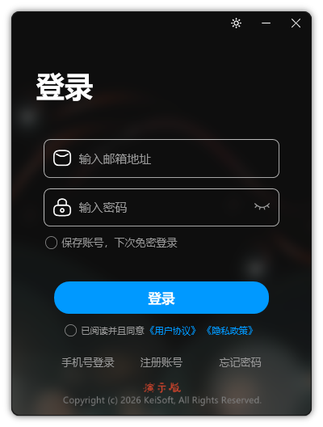
  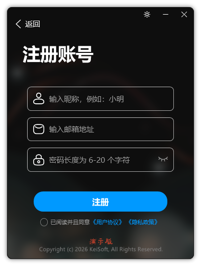
  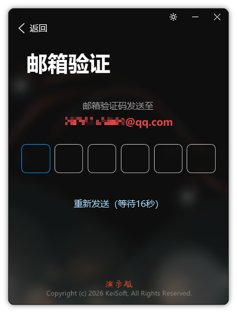
</p>


### 主聊天界面

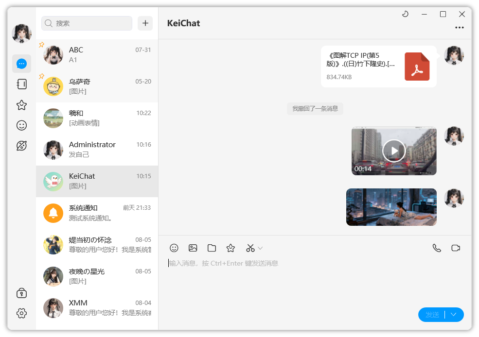

### 好友与群组

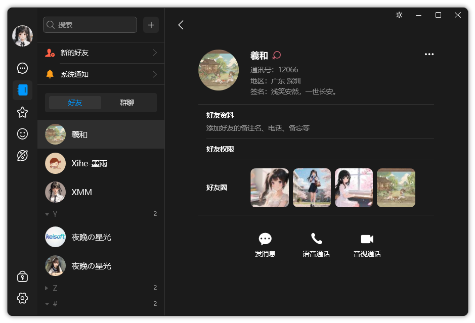

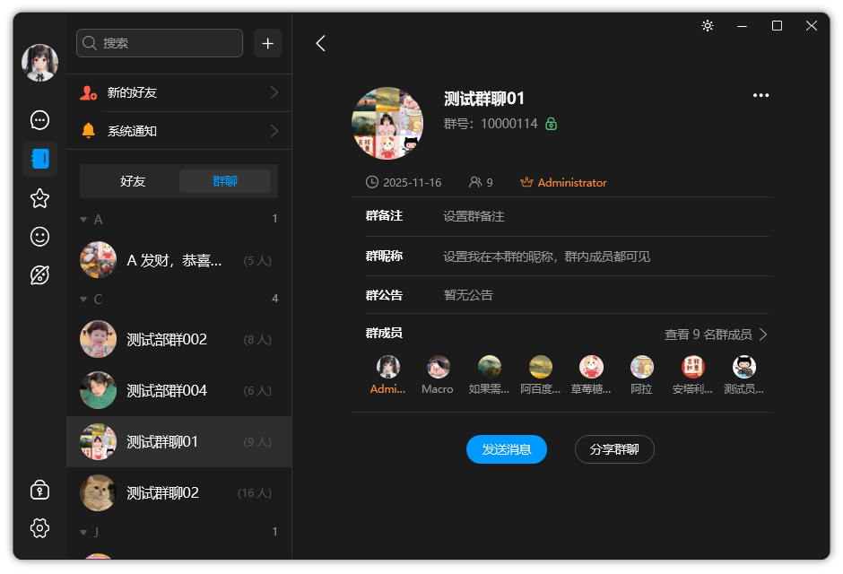

### 好友圈与收藏

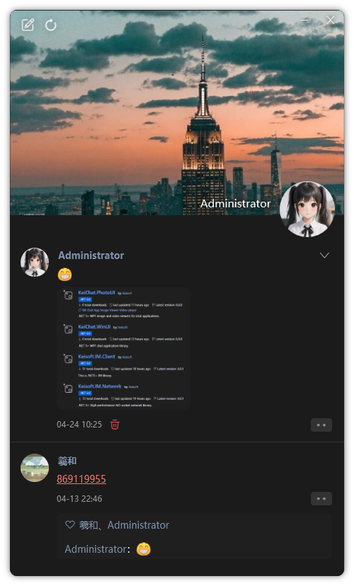

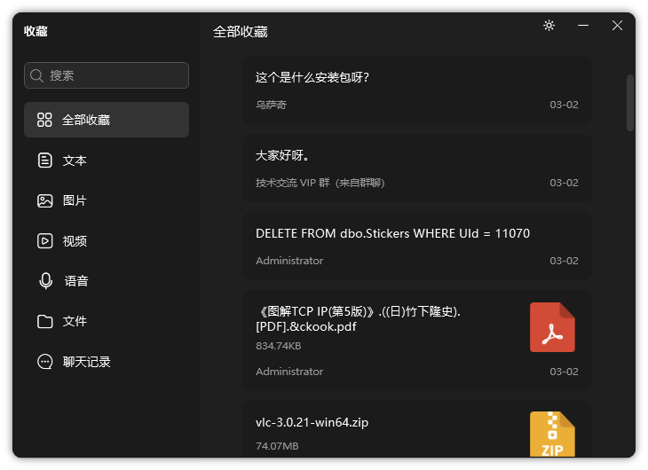

### 图片查看与视频播放

<p>
  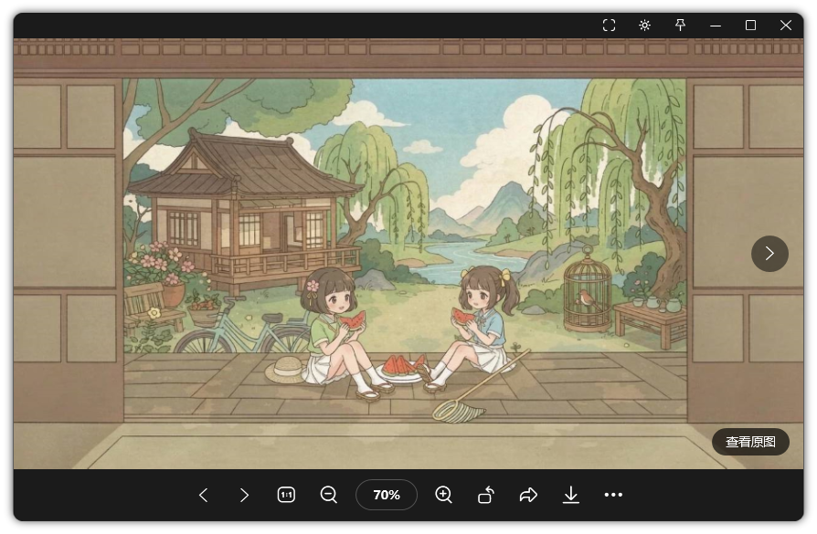
  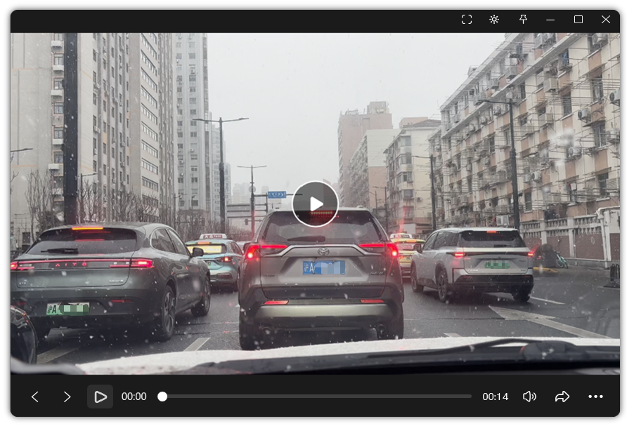
</p>

---


## 💻操作系统支持

| 操作系统 | 状态 | 备注 |
|---|---|---|
| 🟢 **Windows 7** | ✅ 支持 | SP1 及以上，.NET 6 Runtime 自带所需功能 |
| 🟢 **Windows 8.1** | ✅ 支持 | 直接支持 |
| 🟢 **Windows 10** | ✅ 推荐 | 最佳体验，Win10 1903+ |
| 🟢 **Windows 11** | ✅ 推荐 | 最佳体验 |
| ❌ **Windows XP** | ❌ 不支持 | WPF 需 .NET Framework 3.0+，已放弃支持 |

> ✅ **KeiChat 向下兼容至 Windows 7**，无需手动安装 .NET Framework，.NET 6 运行时已包含 WPF 全部所需组件。

---


## 📦 安装体验

- #### Windows x64（Windows8 及以上）[](https://github.com/macroecho/keichat.wpf/releases/download/6.0.5/KeiChat-6.0.5-x64-Installer.exe)

- #### Windows 7 x64 [](https://github.com/macroecho/keichat.wpf/releases/download/6.0.5/KeiChat-6.0.5-win7-x64-Installer.exe)


---


## 🛠️ 技术栈

- **开发框架**：.NET 6 或.NET 9
- **桌面框架**：WPF
- **架构模式**：MVVM
- **实时通信**：原生 Socket + 自定义二进制协议 + SSL/TLS
- **序列化**：MemoryPack / Protobuf
- **进程通信**：MemoryMappedFile + Semaphore
- **UI 渲染**：WPF 控件模板 + 动画
- **本地数据存储**：SQLite3（好友、群组、好友圈、聊天记录）

---


## 🧪 开发环境要求

- Windows 10/11
- .NET 6 SDK 或 .NET 9 SDK
- Visual Studio 2022+

---


## 🚀 服务端一键部署（Docker Compose）

- [查看 Keisoft.Chat.Server 部署方案](https://github.com/macroecho/keisoft.chat.server)

- `App.xaml.cs` 配置如下：

    ```c# 
    // KeiChat 业务服务的网关地址。
    AppSettings.SetGateway("https://demo-chat.example.com");
    
    // KeiChat 文件服务的网关地址。
    AppSettings.SetUploadFileGateway("https://demo-chat.example.com/upload-file");
    AppSettings.SetUploadVideoGateway("https://demo-chat.example.com/upload-video");
    AppSettings.SetUploadPictureGateway("https://demo-chat.example.com/upload-image");
    
    // 保留 upload-audio、upload-merge。
    AppSettings.SetUploadAudioGateway("https://demo-chat.example.com/upload-audio");
    AppSettings.SetUploadMergeGateway("https://demo-chat.example.com/upload-merge");
    
    // 即时通讯服务的网关地址。可写 https (ims)、或 http (im)
    AppSettings.SetIMServerHost("ims://demo-im.example.com");
    // 非 80 或 433 在这里指定端口。
    // AppSettings.SetIMServerPort(8080);
    ```

---


## ⚖️使用条款与免责声明

**1.合法使用**：本系统的使用受以下条件限制：您确认并同意仅将本系统用于合法目的，并遵守所有适用的法律法规，包括但不限于您所在司法管辖区、行为发生地及目标影响地的相关法律。您不得利用本系统从事任何侵犯他人合法权益、违反法律规定或危害网络安全的行为。

> 若您违反上述任何条件，本授权立即终止，您必须立即停止使用本系统并删除所有相关副本。因您违反本声明导致的任何法律责任，由您自行承担，本项目维护者保留追究法律责任的权利。

**2.开源性质**：本项目以开源形式提供，供学习、研究与技术交流之用。开发者不对本系统的功能完整性、安全性、稳定性或适用性作任何明示或暗示的保证。

**3.无担保声明**：在法律允许的最大范围内，开发者不对因使用或无法使用本系统所导致的任何直接、间接、附带、特殊或后果性损害承担责任，包括但不限于数据丢失、业务中断或其他商业损害。

**4.风险自担**：您理解并同意：使用本系统所产生的所有风险由您自行承担，包括但不限于系统漏洞、第三方依赖风险及运行环境风险。

**5.素材声明**：本仓库截图中所展示的头像、图片消息、好友圈配图等内容均来源于互联网，仅用于产品功能演示，**并非本应用程序实际生成或收集的内容**。相关素材版权归原作者所有，若您是权利人且认为使用不当，请联系我们处理。

**6.知识产权**：本系统及相关代码、文档的知识产权归**原作者所有**。未经书面许可，不得将本系统用于商业目的或擅自篡改、再分发。

---


## 💬 技术交流群

欢迎加入 KeiChat 技术交流群，一起交流 **.NET、WPF、Avalonia、Xamarin、WebRTC、实时音视频通信、即时通讯架构、多进程设计** 等话题 👇


- **QQ 群号**：283798566
- **入群方式**：扫码加入或通过 QQ 搜索群号申请加入
- **交流内容**：WPF MVVM 架构、Socket 通信、项目 Issue 讨论

> 💡 没有 QQ 的朋友也可以在 GitHub Issues 中留言交流。

---


## 📄 许可证

MIT License

---

<p align="center">
  
  <br/>
  ⭐ 如果 KeiChat 对你学习 WPF 或开发桌面 IM 有帮助，欢迎 Star 支持！
</p>